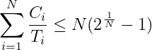
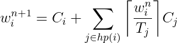

Exercise 6 : Scheduling
=======================

1: Properties of a real-time scheduler
--------------------------------------

 1. Why do we assign priorities to tasks?
 2. What features must a scheduler have for it to be usable for real-time systems?

 
2: Scheduling algorithms
------------------------

The table below describes the release time and execution time for four different tasks, which will be run on a single processor. These tasks only run once, then terminate.

**Task set 1:**

| Task | Release time | Execution time |
|------|--------------|----------------|
| a    | 0            | 5              |
| b    | 2            | 2              |
| c    | 4            | 4              |
| d    | 6            | 3              |

Draw Gantt charts to show how task set **1** executes:

 1. With a first-in-first-out (FIFO) scheduling algorithm
 1. With a round-robin scheduling algorithm, with a time slice quanta of `q = 1`

3: Inversion and inheritance
----------------------------

**Task set 2:**

| Task | Priority   | Execution sequence | Release time |
|------|------------|--------------------|--------------|
| a    | 3          | `E Q V E`          | 4            |
| b    | 2          | `E V V E E E`      | 2            |
| c    | 1 (lowest) | `E Q Q Q E`        | 0            |

 - `E` : Executing
 - `Q` : Executing with resource Q locked
 - `V` : Executing with resource V locked

Draw Gantt charts to show how task set **2** executes:

 1. Without priority inheritance
 1. With priority inheritance

Explain:

 1. What is priority inversion? What is unbounded priority inversion?
 1. Does priority inheritance avoid deadlocks?

4: Utilization and response time
--------------------------------

**Task set 3:**

| Task | Period (T) | Exec. Time (C) |
|------|------------|----------------|
| a    | 50         | 15             |
| b    | 30         | 10             |
| c    | 20         | 5              |

 1. There are a number of assumptions/conditions that must be true for the utilization and response time tests to be usable (The "simple task model"). What are these assumptions? Comment on how realistic they are.
 1. Perform the utilization test for task set **3**. Is the task set schedulable?
 1. Perform response-time analysis for task set **3**. Is the task set schedulable? If you got different results than in 2), explain why.
 1. (*optional*) Draw a Gantt chart to show how the task set executes using rate monotonic priority assignment, and verify that your conclusions are correct.

Formulas
========

Utilization:  

Response time:  

