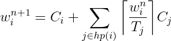

Exercise 6 : Scheduling
=======================

1: Properties of a real-time scheduler
--------------------------------------

 1. Why do we assign priorities to tasks?
--  Priorities are assigned to tasks so that processes that have a more stringent deadline are executed before 'general' tasks.
 2. What features must a scheduler have for it to be usable for real-time systems?
--  The scheduler must be predictable such that when tests are performed deadlines for tasks can be verified.
 
2: Scheduling algorithms
------------------------

The table below describes the release time and execution time for four different tasks, which will be run on a single processor. These tasks only run once, then terminate.

**Task set 1:**

| Task | Release time | Execution time |
|------|--------------|----------------|
| a    | 0            | 5              |
| b    | 2            | 2              |
| c    | 4            | 4              |
| d    | 6            | 3              |

Draw Gantt charts to show how task set **1** executes:

 1. With a first-in-first-out (FIFO) scheduling algorithm

TASK	1	2	3	4	5	6	7	8	9	10	11	12	13	14
														
a	a	a	a	a	a									
b						b	b							
c								c	c	c	c			
d												d	d	d

 2. With a round-robin scheduling algorithm, with a time slice quanta of `q = 1`
	E	Q	Q
0	a		
1	a		
2	a	b	
3	b	a	
4	a	b	c
5	b	c	a
6	c	a	d
7	a	d	c
8	d	c	
9	c	d	
10	d	c	
11	c	d	
12	d	c	
13	c		
14			

E-Execute
Q- Queue

3: Inversion and inheritance
----------------------------

**Task set 2:**

| Task | Priority   | Execution sequence | Release time |
|------|------------|--------------------|--------------|
| a    | 3          | `E Q V E`          | 4            |
| b    | 2          | `E V V E E E`      | 2            |
| c    | 1 (lowest) | `E Q Q Q E`        | 0            |

 - `E` : Executing
 - `Q` : Executing with resource Q locked
 - `V` : Executing with resource V locked

Draw Gantt charts to show how task set **2** executes:

 1. Without priority inheritance
	0	1	2	3	4	5	6	7	8	9	10	11	12	13	14
a					E							Q	V	E	
b			E	V		V	E	E	E						
c	E	Q								Q	Q				E
															

 1. With priority inheritance
	0	1	2	3	4	5	6	7	8	9	10	11	12	13	14
a					E			Q		V	E				
b			E	V					V			E	E	E	
c	E	Q				Q	Q								E

Explain:

 1. What is priority inversion? What is unbounded priority inversion?
-- Priority inversion happens when a high priority task is prempted by a low priority task indirectly. This causes the higher priority task to wait for the lower priority task.
-- In shared resources,Unbounded priority inversion occurs when a higher priority task is in a waiting state due to a lower priority task taking hold of the mutex.
 1. Does priority inheritance avoid deadlocks?
-- No it does not. This is one of the disadvantages since tasks are able to lock separate resources but claim the priority of the other.

4: Utilization and response time
--------------------------------

**Task set 3:**

| Task | Period (T) | Exec. Time (C) |
|------|------------|----------------|
| a    | 50         | 15             |
| b    | 30         | 10             |
| c    | 20         | 5              |

 1. There are a number of assumptions/conditions that must be true for the utilization and response time tests to be usable (The "simple task model"). What are these assumptions? Comment on how realistic they are.
-- The application is assumed to consist of a fixed set of tasks.
	
-- All tasks are periodic, with known periods.
-- The tasks are completely independent of each other.
-- All system overheads, context-switching times and so on are ignored (that is,assumed to have zero cost).
-- All tasks have deadlines equal to their periods (that is, each task must complete before it is next released).
-- All tasks have fixed worst-case execution times.
-- No tasks contains any internal suspension points (e.g an internal delay statement or a blocking I/O request).
-- All tasks execute on a single processor(CPU).

 2. Perform the utilization test for task set **3**. Is the task set schedulable?
--  From epn-utilization.png we can derive the utilization o f the task.
--  From LHS: U = (15/50) + (10/30) + (5/20) = 53/60 appx 0.8833
--  From RHS N = Number of tasks = 3: U = 3(2 ^(1/3)-1) = appx 0.7798
--  Since LHS is greater than RHS we make the below conclusion:
--  The test fails and so we cannot conculde yet that this task is not schedulable.However, we need to to perform further tests to conclude this. Example, using a Gantt chart or response-time analysis.

 3. Perform response-time analysis for task set **3**. Is the task set schedulable? If you got different results than in 2), explain why.
-- From eqn-responsetime.png we can make the following computation for the worst-case response times.

-- Task a:
-- w0 = 15
-- w1 = 15 + (15/30)*10 + (15/20)*5 = 30
-- w2 = 15 + (30/30)*10 + (30/20)*5 = 35
-- w3 = 15 + (35/30)*10 + (35/20)*5 = 45
-- w4 = 15 + (45/30)*10 + (45/20)*5 = 50
-- w5 = 15 + (50/30)*10 + (50/20)*5 = 50
-- => Ra = 50 <= 50, ok

-- Task b:
-- w0 = 10
-- w1 = 10 + (10/20)*5 = 15
-- w2 = 10 + (15/20)*5 = 15
-- => Rb = 15 <= 30, ok

-- Task c:
-- w0 = 5 => Rc = 5 <= 20, ok

Utilization Test :Suffcient but not necessary. 
Response-time Analysis: Sufficient and necessary.

 4. (*optional*) Draw a Gantt chart to show how the task set executes using rate monotonic priority assignment, and verify that your conclusions are correct.

Formulas
========

Utilization:  

Response time:  

